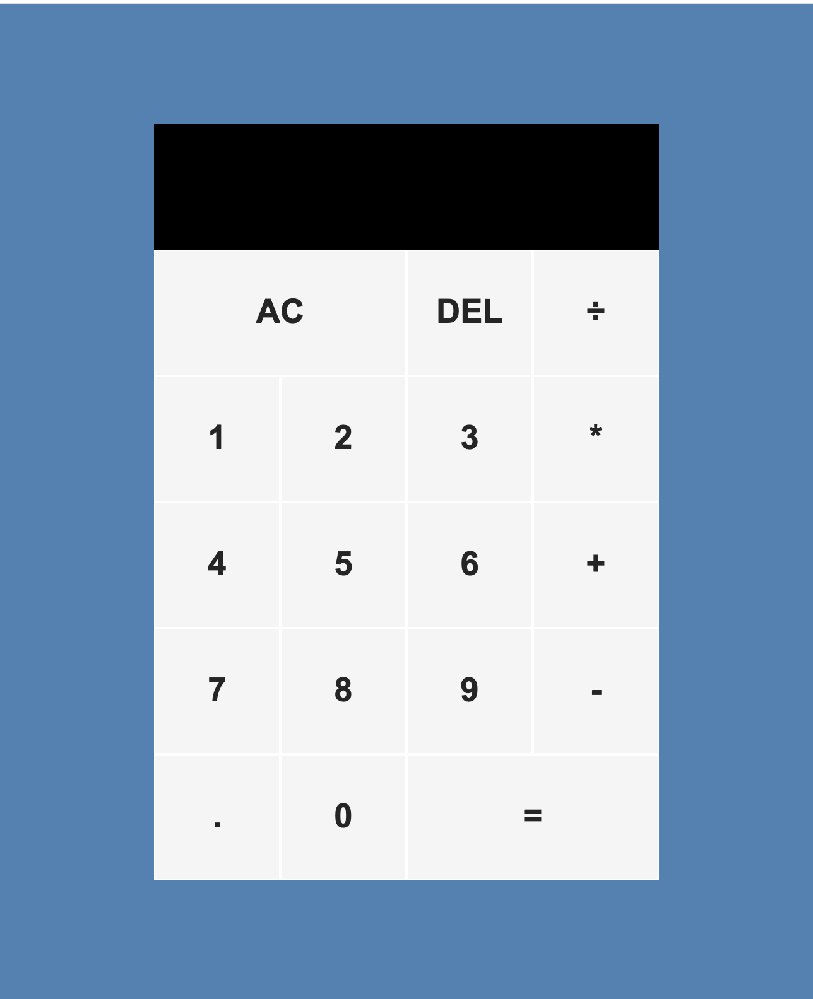

# Calculator-app
This is a Calculator app written in Javascript, HTML, and CSS.

Click <a href="https://mauroleos.github.io/Calculator-app/">here</a> to see website.

# Summary
  This calculator allows you to perform addition, multiplication, division, and subtraction using multiple digits, and allows the use of decimal points. You also have the option to use a delete button, allowing you to remove the last number in the display.
  This application was essential to my learning experience due to the fact that it gave me the opportunity to dive deeper into JavaScript and advance my overall ability to use logic to solve problems, and write clean code.
  
# Author
<strong>Mauro Leos</strong>-<i>Full-Stack Software Developer</i>-<a href="https://www.linkedin.com/in/mauro-leos-b4103a11b/">LinkedIn</a>
